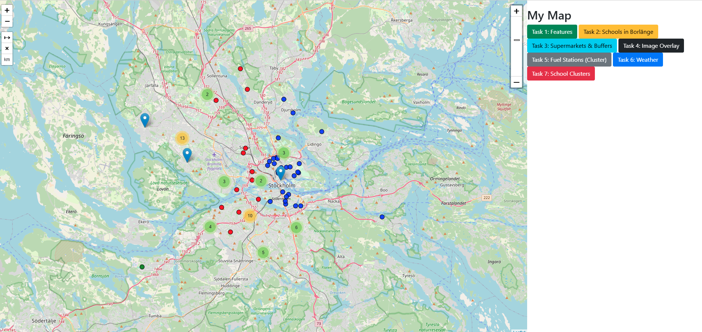

#  GIS Flask Web Application

An interactive Flask web app built to visualize and analyze **spatial GIS data** using **Leaflet.js**, **GeoJSON**, and modern Leaflet plugins. The app simulates realistic geospatial tasks such as school clustering, buffer zone analysis, supermarket service zones, weather overlays, and vector layer management.

> A full-stack web-GIS application powered by **Python Flask**, **JavaScript**, and **Leaflet**, with real-time interaction and data-driven decision-making features.

---

##  Features

###  Tasks Implemented:
| Task | Description |
|------|-------------|
| **Task 1** | Show vector layers: roads, buildings, sidewalks, intersections |
| **Task 2** | Plot schools in Borlänge using GeoJSON |
| **Task 3** | Buffer zones (1000m & 1500m) around supermarkets |
| **Task 4** | Image overlay onto specific coordinates |
| **Task 5** | Cluster fuel stations using MarkerCluster |
| **Task 6** | Display real-time weather with OpenWeatherMap API |
| **Task 7** | Cluster schools using **K-Means** into 3 spatial groups |

---

##  Technologies Used

**Backend**
- Python 3
- Flask

**Frontend**
- Leaflet.js
- Turf.js
- MarkerCluster Plugin
- PolylineMeasure Plugin
- Sidebar Plugin
- ZoomSlider Plugin

**APIs**
- OpenWeatherMap API (Task 6)

---

##  Project Structure

```
Assignment1GIS_Final/
├── app.py                   # Flask backend
├── static/
│   ├── js/                  # Task logic, Leaflet, plugins, GeoJSON layers
│   ├── css/                 # Styling and layout
│   └── images/              # Custom overlay images (optional)
├── templates/
│   └── index.html           # Jinja2 + Leaflet HTML frontend
├── .gitignore               # Git exclusions
├── requirements.txt         # (optional) Python dependencies
└── README.md                # This file
```

---

##  How to Run the App

```bash
# 1. Clone the repo
git clone https://github.com/kushitec15691/GIS_Flask_WebApp.git
cd GIS_Flask_WebApp

# 2. Optional: Create a virtual environment
python -m venv venv
source venv/bin/activate     # On Windows: venv\Scripts\activate

# 3. Install Flask
pip install flask

# 4. Run the Flask server
python app.py

# 5. Open in browser
http://127.0.0.1:5000
```

---

##  Weather API Setup

To enable weather data display:
- Register at [https://openweathermap.org/](https://openweathermap.org/)
- Replace the demo API key in `static/js/your_task_logic.js` with your own

---

##  Screenshot

### Interactive GIS Dashboard with Task Buttons & Clustering



- Color-coded cluster markers for schools
- Fuel stations clustered by region
- Buffers show supermarket coverage
- Weather loads by clicking anywhere
- Sidebar toggles each task layer

---

##  Results & Insights

###  Urban Spatial Insights
- **K-Means School Clustering (Task 7)** clearly segmented school zones into 3 districts, useful for planning and education zoning.
- **Fuel Station Clusters (Task 5)** revealed dense availability in inner Stockholm, sparse in outer municipalities.
- **Supermarket Buffers (Task 3)** highlighted neighborhoods with lower access to grocery services based on distance.
- **Real-Time Weather (Task 6)** adds live data context for situational or environmental applications.
- **Image Overlay (Task 4)** demonstrated how custom raster maps or historic data can be integrated visually.
- **Task Buttons & Leaflet Plugins** enhance interactivity and usability — from measuring distances to layer toggles.

---

##  Learning Highlights

- Web-GIS development using Flask + Leaflet
- Dynamic map interaction via JavaScript and APIs
- Integrating GeoJSON spatial data layers
- Applying geospatial logic (buffering, clustering)
- Combining client-side plugins with Python backend
- Creating reusable, toggleable spatial tasks in UI

---

##  Author

**Kushmi Anuththara**  
🎓 Data Science | GIS Developer  
📍 Based in Sweden  
🌐 [LinkedIn](https://www.linkedin.com/in/your-profile) *(replace with real link)*  


---

## Contribution

Feel free to fork, improve, or use it as a template for your own GIS app. Pull requests and stars are welcome!

---

##  License

MIT License — use freely with credit.
